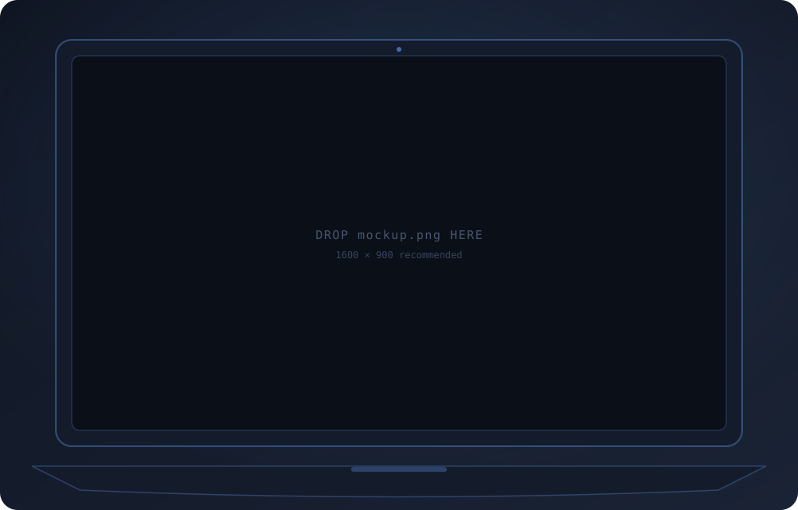
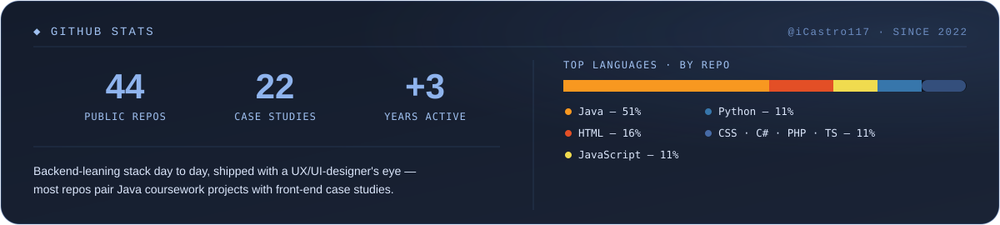
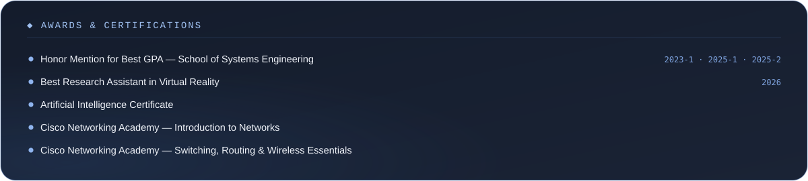

  

  

  

 

<!--
  The screenshot is baked into assets/mockup-frame.svg as embedded image
  data (GitHub blocks an SVG shown via  from loading any external
  image inside it, so it can't just reference mockup.png live). To swap
  in a new screenshot, replace mockup.png and ask for this file to be
  regenerated — it's not a drop-in-and-refresh file on its own anymore.
-->

 

 

  

  

 

  

