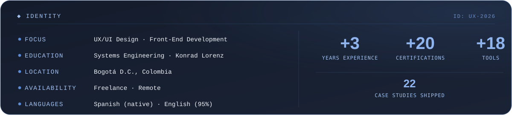
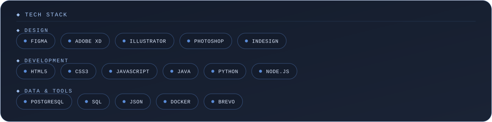
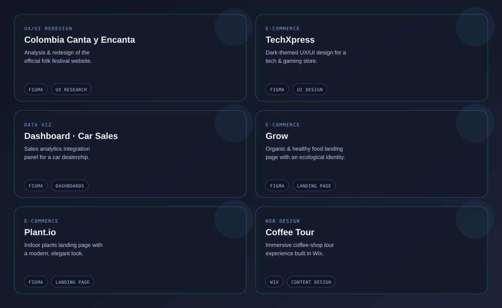

  

  

  

 

<!--
  Drop your own screenshot/mockup at github-profile/mockup.png (1600×900 or
  similar recommended) and it appears framed here automatically — the frame
  below just references that file, nothing else needs to change.
-->

 

  

  

 

|  |  |  |
|---|---|---|
| **Colombia Canta y Encanta** |  |  |
| **TechXpress** |  |  |
| **Dashboard · Car Sales** |  |  |
| **Grow** |  |  |
| **Plant.io** |  |  |
| **Coffee Tour** |  |  |

*22 case studies in total — see the [full portfolio](https://github.com/iCastro117/PORTFOLIO-ISABELLA-CASTRO-CAMACHO) for everything, from UX/UI design to database systems, game design and packaging.*

 

  

